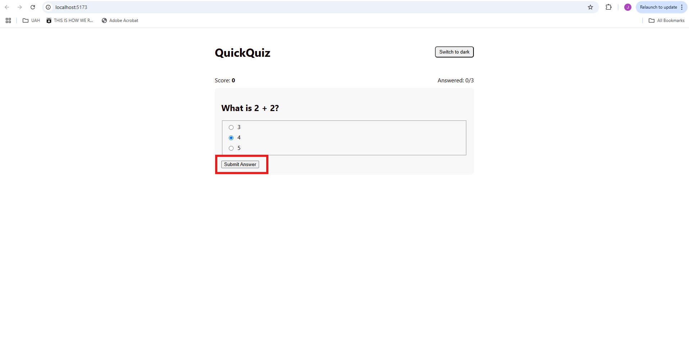
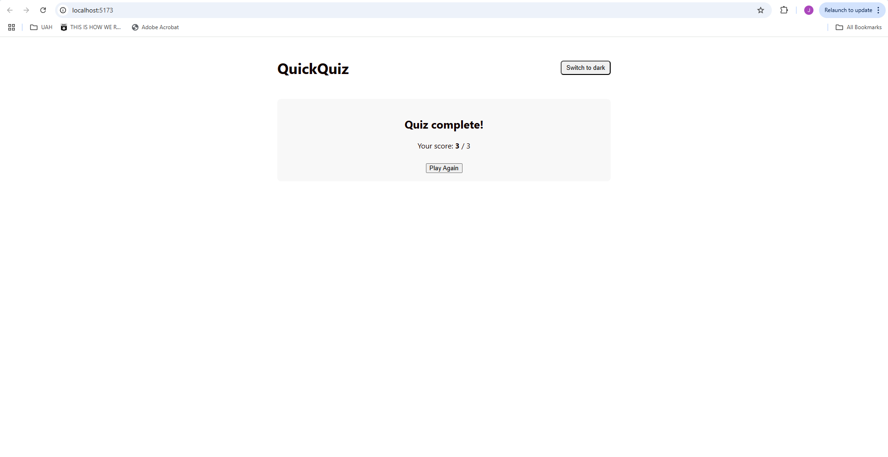

# Overview
QuickQuiz is a small, accessible multiple-choice quiz app built with React + TypeScript. The goal is to demonstrate how well-written tests can specify behavior clearly enough that another developer could implement the app from scratch using only this README and the tests.

## Scope of assessment: 
Only this README and the tests inside tests/ are provided for submission, per the assignment instructions.

## User Stories
As a user, I can see a Landing screen with a description and a “Start Quiz” button.

As a user, I can toggle between light/dark themes at any time.

As a user, when I start the quiz, I see one Question card at a time with mutually exclusive answer options and a disabled Submit button until I pick an option.

As a user, when I submit an answer, my ScoreBoard updates (score, answered/total) and I automatically move to the next question.

As a user, after the final question, I see a Result screen with my final score and a Play Again button.

As a user, when I click Play Again, the app resets to the Landing screen with all state cleared and the theme preserved.

## Features & Behavior (Acceptance Criteria)
### LandingScreen

- Renders an h2 heading “Welcome to QuickQuiz”

- Renders a description paragraph

- Renders a button with aria-label="start-quiz" that calls onStart when clicked

### ThemeToggle

- A button with aria-label="toggle-theme"

- Label text reflects current theme:

  - theme="light" → shows text “Switch to dark”
  

  - theme="dark" → shows text “Switch to light”
  

- Clicking the button triggers onToggle and updates the document root attribute data-theme to "light" or "dark"

- Theme persists when navigating between screens

### QuestionCard

- Displays the question in an h2

- Renders N radio inputs (one per option) with:

  - name="q-{question.id}"

  - aria-label="answer-{index}"

### Submit button:

- type="submit", aria-label="submit-answer"

- Disabled until a radio option is selected

- On submit, calls onSubmit(selectedIndex)

- When the question prop changes, the current selection resets to none

### ScoreBoard

- Renders a live region (role="status" with aria-live="polite")

- Displays Score: {score} and Answered: {answered}/{total}

### ResultScreen

- Shows h2 heading “Quiz complete!”

- Shows final score in the format Your score: {score} / {total}

- “Play Again” button (aria-label="play-again") calls onPlayAgain

### Quiz Flow

- Starting the quiz transitions from Landing → Question 1

- Submitting each answer advances to the next question, updating ScoreBoard

- After the last question, navigate to ResultScreen

- Clicking Play Again returns to LandingScreen, resets quiz state, and preserves theme

## What the tests cover
### Integration Tests — App.integration.test.tsx 
1. Starts quiz from landing screen

- Uses getByRole and simulates click to transition screens

2. Answers a question and updates scoreboard

- Verifies stateful updates to role="status" (Answered count & Score)

3. Completes quiz and shows result screen

- Loops through submitting answers until result screen visible

4. Play again resets quiz

- Ensures full reset to Landing with heading and Start button

5. Toggles theme and persists across quiz

- Confirms data-theme changes and persists after navigation

### Unit Tests 
- LandingScreen.test.tsx

1. Renders Start button (getByRole)

2. Calls onStart on click (event: click)

3. Renders heading and description

- QuestionCard.test.tsx 

1. Renders question text in h2

2. Renders all radios (getAllByRole)

3. Renders all option labels

4. Does not call onSubmit before submit

5. Calls onSubmit with selected index after submit (events: click on radio + submit)

6. Submit button disabled with no selection

7. Submit button enabled when option selected

8. Updates selection when another option is chosen (radio change via click)

9. Does not submit when disabled

- ResultScreen.test.tsx

1. Displays final score text in required format

2. Calls onPlayAgain on click

3. Renders heading “Quiz complete!”

- ScoreBoard.test.tsx 

1. Renders Score: and Answered: x/y

2. Handles zero values

- ThemeToggle.test.tsx 

1. Correct label for light theme

2. Correct label for dark theme

3. Calls onToggle on click

4. Has correct aria-label